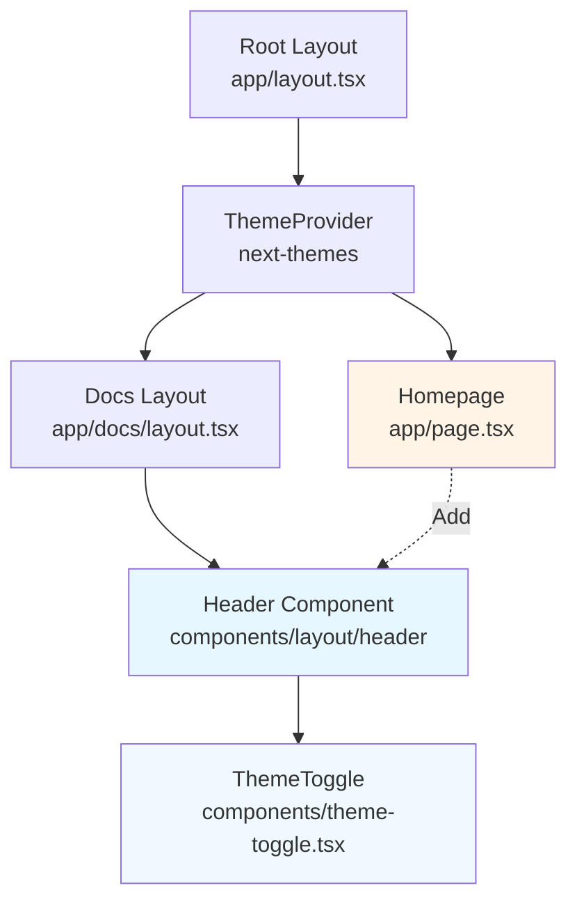
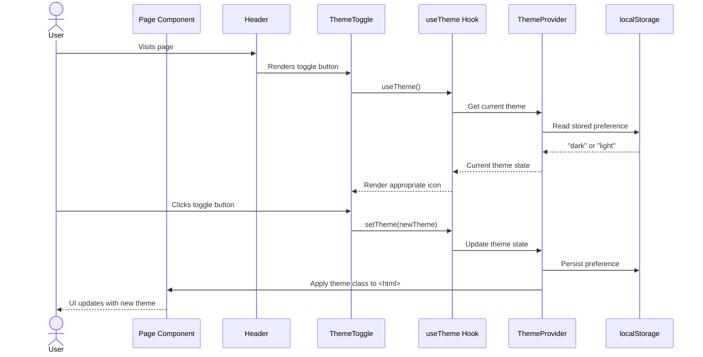
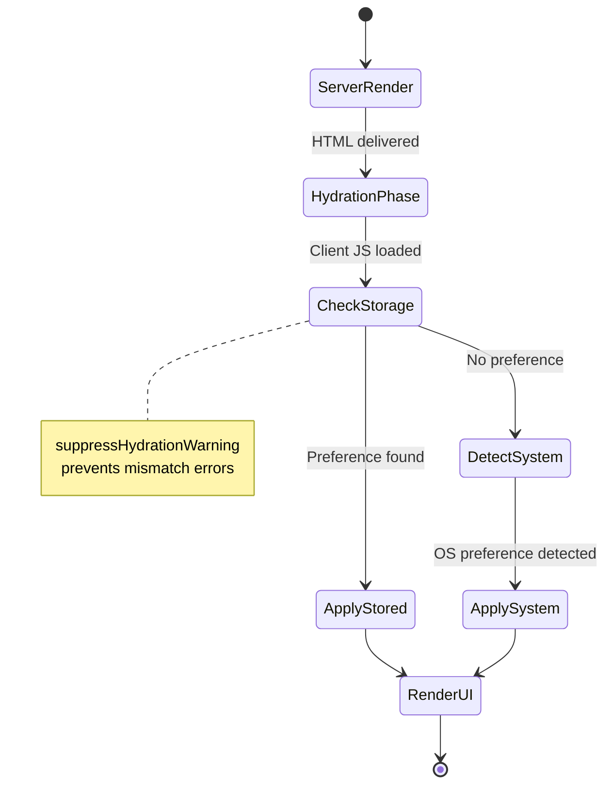

# Design Document: Dark Mode Toggle Integration

## Overview

This feature integrates the existing dark mode toggle component into all pages of the Antigravity Kit dashboard, providing users with seamless theme switching across the entire application.

**Purpose**: Enable users to toggle between light and dark themes consistently across all pages (homepage, documentation, and future pages) using the existing `ThemeToggle` component.

**Users**: All visitors to the Antigravity Kit documentation site will have immediate access to theme preferences that persist across sessions.

**Impact**: Extends the existing Header component (currently only on documentation pages) to the homepage, providing unified navigation and theme control across all pages.

### Goals
- Integrate existing ThemeToggle component into all pages uniformly
- Ensure theme preference persists across sessions via localStorage
- Maintain SSR/hydration safety to prevent theme flashing
- Meet WCAG 2.1 AA accessibility standards for keyboard navigation and touch targets
- Provide consistent visual experience across light and dark themes

### Non-Goals
- Creating new theme toggle component (already exists)
- Implementing additional theme variants beyond light/dark
- Redesigning existing Header component structure
- Adding theme customization or color picker features
- Implementing system-wide theme settings page

## Architecture

### Existing Architecture Analysis

**Current Implementation**:
- `ThemeProvider` wraps entire application in `app/layout.tsx` using `next-themes`
- `ThemeToggle` component (`components/theme-toggle.tsx`) implements toggle UI
- `Header` component (`components/layout/header/index.tsx`) renders ThemeToggle at line 63
- Documentation pages use `DocsLayout` which includes Header component
- Homepage (`app/page.tsx`) uses standalone layout without Header/navigation

**Constraints to Respect**:
- Next.js App Router SSR/hydration patterns must be maintained
- Existing Button component styling system from @base-ui/react
- Theme provider configuration (default dark, system preference enabled)
- Current responsive design patterns and breakpoints

**Integration Points**:
- Homepage layout must integrate existing Header component
- No changes to ThemeToggle or Header implementation required
- Maintain existing ThemeProvider configuration

### Architecture Pattern & Boundary Map

**Selected Pattern**: Component Composition with Shared Layout

The architecture follows Next.js App Router layout composition pattern, where shared UI components (Header, Footer) are integrated through layout files rather than duplicated per page.



**Architecture Integration**:
- **Selected pattern**: Layout composition - reuse Header across pages via layout hierarchy
- **Domain/feature boundaries**: 
  - Theme management (next-themes library) - handles state, persistence, system detection
  - UI components (Button, ThemeToggle) - pure presentation, no business logic
  - Layout components (Header) - composition and positioning
- **Existing patterns preserved**: 
  - Client component boundary markers (`"use client"`)
  - SSR-safe hydration with mounted state
  - Responsive design using Tailwind breakpoints
- **New components rationale**: None - all required components exist
- **Steering compliance**: Follows clean-code principle (no duplication), Next.js best practices, component composition over repetition

### Technology Stack

| Layer | Choice / Version | Role in Feature | Notes |
|-------|------------------|-----------------|-------|
| Frontend | Next.js 16.1.3 | App Router, SSR, layouts | Already in use |
| Frontend | React 19.2.3 | Component rendering | Already in use |
| Frontend | next-themes 0.4.6 | Theme state management, persistence | Already configured |
| Frontend | @base-ui/react 1.1.0 | Button component system | Used by ThemeToggle |
| Frontend | Tailwind CSS 4.x | Responsive styling, dark mode classes | Already configured |
| Frontend | lucide-react 0.562.0 | Icon system (optional for sun/moon icons) | Available if needed |

No new dependencies required. All technology choices already established in existing implementation.

## System Flows

### User Theme Toggle Flow



**Flow Decisions**:
- **Hydration safety**: Toggle shows skeleton until client-side mount completes
- **Persistence**: localStorage write happens immediately on theme change
- **Reactivity**: Theme class on `<html>` element triggers CSS transitions across entire app

### Page Load with Theme Restoration



## Requirements Traceability

| Requirement | Summary | Components | Interfaces | Flows |
|-------------|---------|------------|------------|-------|
| 1.1 | Consistent toggle placement | Header | HeaderProps | - |
| 1.2 | Immediate theme switch on click | ThemeToggle | ThemeToggleProps | User Theme Toggle Flow |
| 1.3 | Toggle in navigation header | Header, DocsLayout | - | - |
| 1.4 | Visual styling matches theme | ThemeToggle, Button | ButtonProps | - |
| 2.1 | Persist to localStorage | ThemeProvider (next-themes) | ThemeProviderProps | User Theme Toggle Flow |
| 2.2 | Apply stored theme on return | ThemeProvider (next-themes) | - | Page Load Flow |
| 2.3 | Respect OS theme on first visit | ThemeProvider (enableSystem) | ThemeProviderProps | Page Load Flow |
| 2.4 | User preference over system | ThemeProvider (priority logic) | - | Page Load Flow |
| 3.1 | Skeleton during SSR | ThemeToggle (mounted state) | - | Page Load Flow |
| 3.2 | No render until hydration | ThemeToggle (!mounted check) | - | Page Load Flow |
| 3.3 | suppressHydrationWarning | Root Layout (html element) | - | - |
| 4.1 | aria-label on toggle | ThemeToggle (Button) | ButtonProps | - |
| 4.2 | Enter/Space activation | Button component | - | User Theme Toggle Flow |
| 4.3 | Visible focus indicators | Button (focus-visible) | - | - |
| 4.4 | 44x44px touch target | Button (size variant) | ButtonProps | - |
| 5.1 | Sun/moon icons | ThemeToggle (SVG) | - | - |
| 5.2 | Button component styling | ThemeToggle (Button) | ButtonProps | - |
| 5.3 | Smooth CSS transitions | Global CSS (transition) | - | User Theme Toggle Flow |
| 5.4 | Visually distinguishable | Button (ghost variant) | ButtonProps | - |

## Components and Interfaces

### Component Summary

| Component | Domain/Layer | Intent | Req Coverage | Key Dependencies (P0/P1) | Contracts |
|-----------|--------------|--------|--------------|--------------------------|-----------|
| Homepage | Page Layer | Integrate Header for theme access | 1.1, 1.3 | Header (P0) | - |
| Header | Layout Layer | Provide navigation and theme toggle | 1.1, 1.2, 1.3, 1.4 | ThemeToggle (P0) | - |
| ThemeToggle | UI Component | Render theme toggle button | 1.2, 1.4, 3.1, 3.2, 4.1-4.4, 5.1-5.4 | useTheme (P0), Button (P0) | State |
| ThemeProvider | Context Layer | Manage theme state and persistence | 2.1-2.4, 3.3 | next-themes (P0) | State |

### Page Layer

#### Homepage (app/page.tsx)

| Field | Detail |
|-------|--------|
| Intent | Provide homepage with Header integration for theme toggle access |
| Requirements | 1.1, 1.3 |
| Owner / Reviewers | Frontend Team |

**Responsibilities & Constraints**
- Integrate existing Header component into homepage layout
- Maintain minimal, clean homepage aesthetic
- Ensure responsive behavior on mobile devices
- No business logic - pure structural composition

**Dependencies**
- Inbound: None
- Outbound: Header component — navigation and theme toggle rendering (P0)
- External: None

**Implementation Notes**
- **Integration**: Add Header component import and render at top of page layout structure
- **Validation**: Visual regression testing to ensure homepage aesthetic maintained
- **Risks**: May require styling adjustments to Header for homepage context (e.g., reduced padding, transparent background)

### Layout Layer

#### Header Component

| Field | Detail |
|-------|--------|
| Intent | Provide consistent navigation bar with theme toggle across all pages |
| Requirements | 1.1, 1.2, 1.3, 1.4 |
| Owner / Reviewers | Frontend Team |

**Responsibilities & Constraints**
- Render navigation links and theme toggle consistently
- Maintain responsive layout across breakpoints (mobile, tablet, desktop)
- Position toggle in accessible location (right section)
- No theme logic - delegates to ThemeToggle component

**Dependencies**
- Inbound: DocsLayout (P0), Homepage (P0) — layout composition
- Outbound: ThemeToggle (P0) — theme toggle UI
- Outbound: Button (P0), MobileMenu (P1), SearchDialog (P1), DonateDialog (P1)
- External: None

**Contracts**: None (pure presentation component)

**Implementation Notes**
- **Integration**: Already implemented at `/components/layout/header/index.tsx`, no changes required
- **Validation**: Verify renders correctly on homepage after integration
- **Risks**: None - existing tested component

### UI Components

#### ThemeToggle Component

| Field | Detail |
|-------|--------|
| Intent | Render accessible theme toggle button with hydration safety |
| Requirements | 1.2, 1.4, 3.1, 3.2, 4.1-4.4, 5.1-5.4 |
| Owner / Reviewers | Frontend Team |

**Responsibilities & Constraints**
- Render theme toggle button with appropriate icon (sun/moon)
- Handle SSR/hydration gracefully with skeleton state
- Delegate theme state changes to `useTheme` hook
- Ensure accessibility attributes (aria-label, focus, touch target)
- Maintain visual consistency with Button component styling

**Dependencies**
- Inbound: Header (P0) — renders toggle in navigation
- Outbound: useTheme hook from next-themes (P0) — theme state management
- Outbound: Button component from @base-ui/react (P0) — styled button wrapper
- External: None

**Contracts**: State [ ]

##### State Management

**State Model**:
```typescript
interface ThemeToggleState {
  mounted: boolean;           // Tracks client-side hydration completion
  theme: 'light' | 'dark' | 'system';  // Current theme from useTheme
}
```

**Component Props Interface**:
```typescript
// ThemeToggle accepts no props - self-contained component
interface ThemeToggleProps {} 

// Uses next-themes useTheme hook
interface UseThemeReturn {
  theme: string | undefined;
  setTheme: (theme: string) => void;
  systemTheme: 'light' | 'dark' | undefined;
  themes: string[];
}
```

**Persistence & Consistency**:
- State managed by next-themes library via Context API
- Persistence handled by next-themes (localStorage write on setTheme)
- No local state synchronization needed - useTheme hook provides single source of truth

**Concurrency Strategy**: Not applicable - single-user client-side interaction

**Implementation Notes**
- **Integration**: Already implemented at `/components/theme-toggle.tsx`, no changes required
- **Validation**: 
  - Verify touch target size meets 44x44px minimum (currently 36px with size-9)
  - Test keyboard navigation (Tab, Enter, Space)
  - Verify no hydration warnings in console
- **Risks**: 
  - Touch target size may need adjustment to `size-icon-lg` (40px) or custom padding
  - Icon rotation animation on theme change may cause accessibility issues (prefer fade transition)

### Context Layer

#### ThemeProvider (next-themes)

| Field | Detail |
|-------|--------|
| Intent | Provide theme state management, persistence, and system detection |
| Requirements | 2.1, 2.2, 2.3, 2.4, 3.3 |
| Owner / Reviewers | Frontend Team |

**Responsibilities & Constraints**
- Manage global theme state via React Context
- Persist theme preference to localStorage
- Detect and respect OS-level theme preference on first visit
- Prioritize explicit user selection over system preference
- Provide `useTheme` hook for components to access/modify theme
- Apply theme class to `<html>` element for CSS reactivity

**Dependencies**
- Inbound: Root Layout (P0) — wraps entire application
- Outbound: localStorage Web API (P0) — persistence
- Outbound: matchMedia Web API (P1) — system theme detection
- External: next-themes@0.4.6 (P0)

**Contracts**: State [x] / API [ ]

##### State Management

**State Model**:
```typescript
// Internal state managed by next-themes library
interface ThemeState {
  theme: string;              // Current active theme
  resolvedTheme: 'light' | 'dark';  // Computed theme (resolves 'system')
  systemTheme: 'light' | 'dark' | undefined;  // OS preference
  forcedTheme: string | undefined;  // Override for specific routes
}
```

**Provider Props Interface**:
```typescript
interface ThemeProviderProps {
  attribute?: 'class' | 'data-theme' | 'data-mode';  // HTML attribute to set
  defaultTheme?: string;        // Theme to use on first visit
  enableSystem?: boolean;       // Respect OS preference
  enableColorScheme?: boolean;  // Set color-scheme CSS property
  disableTransitionOnChange?: boolean;  // Prevent CSS transitions during change
  storageKey?: string;          // localStorage key name
  themes?: string[];            // Available theme options
  value?: Record<string, string>;  // Theme class mapping
  nonce?: string;              // CSP nonce for inline script
  children: React.ReactNode;
}
```

**Current Configuration** (from `app/layout.tsx`):
```typescript
<ThemeProvider
  attribute="class"
  defaultTheme="dark"
  enableSystem
  disableTransitionOnChange
>
```

**Persistence & Consistency**:
- localStorage key: `theme` (default)
- Write on every `setTheme()` call
- Read on initial mount and page load
- Atomic write - no race conditions possible in single-tab context

**Implementation Notes**
- **Integration**: Already configured in Root Layout, no changes required
- **Validation**: Verify localStorage persistence across browser sessions
- **Risks**: None - library handles edge cases (localStorage unavailable, SSR, etc.)

## Data Models

### No Data Model Changes

This feature does not introduce new data models or modify existing database schemas. All state is ephemeral (React Context) or client-side only (localStorage).

**State Sufficiency Explanation**:
- Theme preference is user-specific, client-side only
- No server-side personalization or multi-device sync required
- localStorage provides sufficient persistence for single-device usage
- No historical tracking or analytics on theme changes needed

If future requirements include theme preference in user profiles or cross-device sync, a database model would be introduced with these fields:
```typescript
// Future consideration - NOT implemented
interface UserPreferences {
  userId: string;
  theme: 'light' | 'dark' | 'system';
  updatedAt: Date;
}
```

## Error Handling

### Error Strategy

All error scenarios are handled gracefully with fallback behavior rather than blocking user interaction. Theme functionality is non-critical - errors should degrade to usable default state.

**Recovery Mechanisms**:
- localStorage access failures → fallback to system theme detection
- System theme detection unavailable → fallback to `defaultTheme` ("dark")
- Hydration mismatches → suppressed via `suppressHydrationWarning` attribute
- Component mount failures → skeleton UI remains visible (non-blocking)

### Error Categories and Responses

**User Errors** (N/A): Theme toggle has no user input validation - all actions are valid

**System Errors**:
- **localStorage unavailable** (private browsing, quota exceeded):
  - Graceful degradation: Theme changes work in-session via Context state
  - Persistence fails silently, no error shown to user
  - Next visit uses `defaultTheme` or system preference
  
- **matchMedia API unavailable** (older browsers):
  - System theme detection fails silently
  - Falls back to `defaultTheme` configuration
  - Manual toggle still functional

- **Hydration mismatch** (server/client theme mismatch):
  - Suppressed via `suppressHydrationWarning` on `<html>` element
  - Skeleton UI prevents flash of incorrect theme
  - Resolves automatically on client-side mount

**Business Logic Errors** (N/A): No business rules to violate in theme toggling

### Monitoring

**Error Tracking**:
- No explicit error logging for theme functionality (non-critical feature)
- Browser console will show localStorage errors in development (next-themes library logs)
- Hydration warnings suppressed intentionally - not tracked as errors

**Health Monitoring**:
- No uptime/health checks needed (client-side only feature)
- User analytics (if implemented) could track theme preference distribution

## Testing Strategy

### Unit Tests

1. **ThemeToggle Component - Hydration Safety**
   - Verify skeleton UI renders when `mounted` is false
   - Verify toggle button renders when `mounted` is true
   - Verify no theme-dependent content rendered before mount

2. **ThemeToggle Component - Theme Switching**
   - Mock `useTheme` hook to return specific theme
   - Verify correct icon displayed for "dark" theme
   - Verify correct icon displayed for "light" theme
   - Verify `setTheme` called with opposite theme on button click

3. **ThemeToggle Component - Accessibility**
   - Verify `aria-label="Toggle theme"` attribute present on button
   - Verify button has type="button" to prevent form submission
   - Verify button meets minimum touch target size (44x44px)

4. **ThemeProvider Configuration**
   - Verify `attribute="class"` sets theme via class on `<html>`
   - Verify `defaultTheme="dark"` applied on first visit
   - Verify `enableSystem` respects OS preference when no stored preference

5. **Header Component Integration**
   - Verify Header renders ThemeToggle component
   - Verify ThemeToggle positioned in right section of header
   - Verify responsive behavior maintains toggle visibility on mobile

### Integration Tests

1. **Theme Persistence Flow**
   - User toggles theme from dark to light
   - Verify `localStorage.setItem('theme', 'light')` called
   - Reload page
   - Verify light theme restored from localStorage

2. **System Theme Detection**
   - Clear localStorage theme preference
   - Mock `matchMedia('(prefers-color-scheme: dark)')` to return true
   - Load page
   - Verify dark theme applied
   - Mock matchMedia to return false
   - Reload page
   - Verify light theme applied

3. **Header Integration Across Pages**
   - Navigate to homepage
   - Verify Header component rendered
   - Verify ThemeToggle visible in header
   - Navigate to documentation page (/docs)
   - Verify same Header component rendered
   - Verify theme toggle state consistent across navigation

### E2E/UI Tests

1. **Visual Regression - Homepage with Header**
   - Capture screenshot of homepage with Header integrated
   - Verify layout maintains intended aesthetic
   - Verify no content shift when Header added

2. **Theme Toggle Interaction**
   - Load page in light theme
   - Click theme toggle button
   - Verify page transitions to dark theme within 500ms
   - Verify all UI elements update colors appropriately
   - Verify no flash or jarring visual changes

3. **Cross-Page Theme Consistency**
   - Set theme to light on homepage
   - Navigate to documentation page
   - Verify light theme persisted
   - Toggle to dark theme
   - Navigate back to homepage
   - Verify dark theme maintained

4. **Mobile Responsive Behavior**
   - Load page on mobile viewport (375px width)
   - Verify theme toggle visible and accessible
   - Verify touch target size adequate (visual inspection)
   - Tap theme toggle
   - Verify theme changes successfully

### Accessibility Tests

1. **Keyboard Navigation**
   - Tab to theme toggle button
   - Verify visible focus indicator displayed
   - Press Enter key
   - Verify theme toggles
   - Press Space key
   - Verify theme toggles

2. **Screen Reader Compatibility**
   - Navigate to theme toggle with screen reader
   - Verify announces "Toggle theme button"
   - Activate button
   - Verify announces state change (implementation-dependent)

3. **Touch Target Size Verification**
   - Measure computed size of theme toggle button
   - Verify minimum 44x44px touch target (WCAG 2.1 Level AA)
   - If below minimum, recommend size variant adjustment

4. **Color Contrast Validation**
   - Verify toggle button icon has sufficient contrast in light theme (4.5:1 minimum)
   - Verify toggle button icon has sufficient contrast in dark theme (4.5:1 minimum)
   - Verify focus indicator has 3:1 contrast ratio against background

## Security Considerations

**Minimal Security Surface**: This feature operates entirely client-side with no server communication, authentication, or sensitive data handling.

**XSS Prevention**:
- Theme value stored in localStorage is validated by next-themes library (string matching against `themes` array)
- No direct DOM manipulation of theme classes - React handles all updates safely
- No user input accepted - theme selection limited to predefined options ("light", "dark", "system")

**localStorage Security**:
- Theme preference is non-sensitive data (no PII or credentials)
- Accessible only to same-origin scripts (browser security model)
- No encryption needed for theme preference value

**CSP Compatibility**:
- next-themes injects inline script for flash prevention
- If CSP `script-src` is strict, provide `nonce` attribute to ThemeProvider
- Current implementation assumes no CSP restrictions

**No Active Threats**: No authentication bypass, data exfiltration, or privilege escalation vectors in theme toggle functionality.

## Performance & Scalability

### Target Metrics

| Metric | Target | Measurement |
|--------|--------|-------------|
| Theme toggle response time | < 100ms | Click to visual update complete |
| Page load with theme restoration | < 50ms overhead | Time to apply stored theme |
| Hydration skeleton duration | < 200ms | Server HTML to client mount |
| CSS transition duration | 150ms | Background/text color changes |

### Optimization Strategies

**Rendering Performance**:
- ThemeToggle uses `useEffect` to set `mounted` state - single render after hydration
- Theme class on `<html>` element triggers CSS cascade, but minimal DOM changes
- Icon SVGs inlined, no network requests for theme toggle operation

**Bundle Size**:
- next-themes library: ~3KB gzipped (already included)
- ThemeToggle component: ~1KB (minimal JavaScript)
- No additional bundle impact for this feature

**Caching**:
- localStorage read on page load (synchronous, < 1ms)
- No API calls to cache
- Theme preference cached in React Context after initial load

**Scalability** (N/A): Client-side only feature, no server-side scaling concerns

### Performance Risks

- **Risk**: CSS transitions may cause jank on low-end devices during theme change
  - **Mitigation**: Use `disableTransitionOnChange` to prevent transition flash, rely on instant color switch
  
- **Risk**: Large DOM trees may slow down theme class propagation
  - **Mitigation**: Tailwind's class-based theming is optimized for performance, minimal impact expected

## Supporting References

### Button Size Variants

Current button size variants from `components/ui/button.tsx`:

```typescript
size: {
  default: "h-9 px-[calc(--spacing(3)-1px)] sm:h-8",
  icon: "size-9 sm:size-8",           // 36px desktop, 32px mobile
  "icon-lg": "size-10 sm:size-9",     // 40px desktop, 36px mobile
  "icon-sm": "size-8 sm:size-7",      // 32px desktop, 28px mobile
  "icon-xl": "size-11 sm:size-10",    // 44px desktop, 40px mobile
  "icon-xs": "size-7 sm:size-6",      // 28px desktop, 24px mobile
}
```

**Recommendation**: Change ThemeToggle to use `size="icon-xl"` to meet 44x44px WCAG minimum touch target size on desktop.

### TypeScript Interface Definitions

Complete interfaces for all components involved in theme toggle integration:

```typescript
// Root Layout Props
interface RootLayoutProps {
  children: React.ReactNode;
}

// Theme Provider Props (next-themes)
interface ThemeProviderProps {
  attribute?: 'class' | 'data-theme' | 'data-mode';
  defaultTheme?: string;
  enableSystem?: boolean;
  enableColorScheme?: boolean;
  disableTransitionOnChange?: boolean;
  storageKey?: string;
  themes?: string[];
  value?: Record<string, string>;
  nonce?: string;
  children: React.ReactNode;
}

// useTheme Hook Return (next-themes)
interface UseThemeReturn {
  theme: string | undefined;
  setTheme: (theme: string) => void;
  forcedTheme: string | undefined;
  resolvedTheme: 'light' | 'dark' | undefined;
  systemTheme: 'light' | 'dark' | undefined;
  themes: string[];
}

// ThemeToggle Component
interface ThemeToggleProps {}  // No props - self-contained

// Header Component
interface HeaderProps {}  // No props - self-contained

// Button Component (from @base-ui/react)
interface ButtonProps extends React.ButtonHTMLAttributes<HTMLButtonElement> {
  variant?: 'default' | 'destructive' | 'destructive-outline' | 'ghost' | 'link' | 'outline' | 'secondary';
  size?: 'default' | 'icon' | 'icon-lg' | 'icon-sm' | 'icon-xl' | 'icon-xs' | 'lg' | 'sm' | 'xl' | 'xs';
  render?: (props: React.ComponentProps<'button'>) => React.ReactElement | null;
}

// Homepage Component
interface PageProps {}  // No props for root page
```
